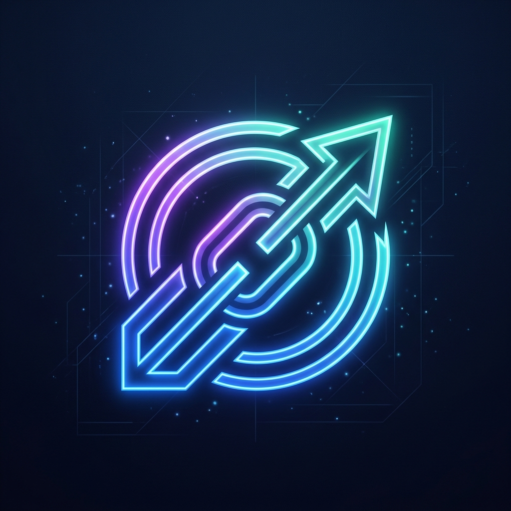
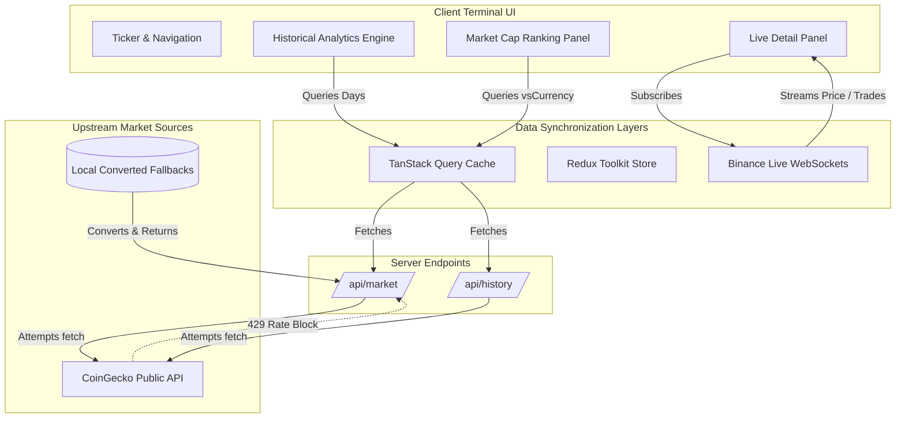

<p align="center">
  
</p>

<h1 align="center">⚡ CryptoDash Pro — Live Trading Terminal</h1>

<p align="center">
  <strong>An ultra-premium, high-performance financial trading dashboard and Next.js PWA terminal.</strong>
</p>

<p align="center">
  <a href="https://github.com/sanketkedare/crypto-dashboard"></a>
  
  
  
</p>

---

## ⚡ Overview

Welcome to **CryptoDash Pro**, an ultra-premium, high-performance **3-column cryptocurrency cryptocurrency trading terminal** built with **Next.js 16 (App Router)**, **TypeScript**, and **Tailwind CSS**.

Designed to mimic professional institutional terminals (like Bloomberg and Reuters), it integrates a full-viewport, non-scrolling, high-density layout featuring real-time WebSocket feeds, granular analytical charting tools, resilient dynamic forex fallbacks, and comprehensive PWA capabilities.

---

## 🔗 Live Deployment & Case Study Info

- **Live Production Terminal:** [https://cryptodash-pro-pi.vercel.app/](https://cryptodash-pro-pi.vercel.app/)
- **Standalone Case Study Interface:** [https://cryptodash-pro-pi.vercel.app/casestudy](https://cryptodash-pro-pi.vercel.app/casestudy)
- **Public Case Study JSON API:** [https://cryptodash-pro-pi.vercel.app/api/case-study](https://cryptodash-pro-pi.vercel.app/api/case-study)

---

## 🚀 Key Architectural Pillars

### 1. High-Performance 3-Column Terminal Layout

- **Left Column (Market Sidebar):** Dynamic rank listing showing live 24h market caps, instant pagination, search filtering, and manual refresh controls.
- **Center Column (Analytics Hero):** Max-height financial charting engine (Bar/Line representation) with a compact bottom Portfolio dashboard (Top Gainers + Live Currency Converter).
- **Right Column (Live Detail HUD):** Dynamic side panel streaming live prices via high-performance Binance WebSockets, supply analytics, and standard transaction bounds.

### 2. Live Forex Server Fallbacks (Zero Downtime)

- **Resiliency Layer:** To bypass the public CoinGecko API rate limits (HTTP 429), our server-side API endpoints (`/api/market` and `/api/history`) automatically intercept blocks.
- **Dynamic Forex Engine:** If CoinGecko is throttled, the server fetches the local INR-based cache and automatically converts all price, volume, and supply metrics on-the-fly to your active currency (`USD`, `EUR`, `YEN`, `INR`) using real-time forex ratios before delivering it.

### 3. High-Density Live Exchange Widget

- **Real-time Conversions:** Rewritten to eliminate stale mock values. The conversion calculations dynamically pull the latest prices from active React Query caches:
  $$\text{Result Amount} = \left( \frac{\text{Sell Price}}{\text{Buy Price}} \right) \times \text{Input Amount}$$
- All conversions update seamlessly when the master global currency config is toggled.

### 4. Progressive Web App (PWA) Enabled

- **Stand-alone Installation:** Fully-configured `manifest.json` with premium glowing maskable icons.
- **Offline Support:** Features a dedicated, secure Service Worker (`sw.js`) that caches runtime static assets and routes navigations to a customized dark-theme [offline.html](public/offline.html) if internet access is interrupted.

### 5. Multi-Year Analytics & Local Time Syncing

- **Extended Range Selector:** Supports comprehensive analytics ranging from `1D`, `1W`, `1M`, `1Y`, up to `5 Years` and `10 Years` historical data.
- **IST Timestamp Syncing:** Renders highly-detailed Indian Standard Time (IST) timestamps using timezone locales under the main header (`Updated: DD MMM YYYY, HH:MM:SS AM/PM IST`).

### 6. CSS Glassmorphism & High-End Aesthetics

- **Color System:** A meticulously curated deep-navy background palette (`#080B14`) contrasted with custom semi-transparent card wrappers using backdrop filters (`backdrop-filter: blur(24px)`).
- **Typography:** The terminal couples the geometric, high-tech font face **Space Grotesk** for structural details and labels with **JetBrains Mono** for active financial tickers and live numerical stats.

---

## ⚡ Real-Time Data Architecture

CryptoDash Pro uses a hybrid stateful data fetching pipeline designed to limit rate blocks while maintaining real-time precision:



1.  **Passive Long-Poll Data Layer (TanStack Query):** Handles historical and currency-denominated listings with highly-granular cache invalidation policies (revalidates list ranks every 60 seconds, chart ranges up to 6 hours).
2.  **Active Stream Data Layer (WebSockets):** Initiates direct client-side raw WebSocket connections to Binance feeds (`wss://stream.binance.com:9443`) for immediate microsecond-level updates to price labels, order logs, and transactional records when a coin detail card is focused.

---

## 🛠️ Technology Stack

- **Framework:** Next.js 16 (App Router)
- **Language:** TypeScript (Strict compiler profiles)
- **State Management:** Redux Toolkit (UI configs, active symbols) + TanStack Query v5 (Data caching)
- **Styling:** Tailwind CSS + CSS Variables Theme Engine (Seamless light/dark integration)
- **Charts:** Chart.js + React ChartJS 2
- **Animations:** Framer Motion
- **Containerization:** Docker (Multi-stage Node Alpine Build)
- **Testing:** Vitest (Unit) + Playwright (E2E)

---

## 📦 Project Structure

```bash
├── .github/workflows/   # CI/CD pipelines (GitHub Actions)
├── public/              # PWAs icons, manifest, offline shells, assets
├── src/
│   ├── app/             # Next.js pages, sitemaps, robots configurations
│   ├── components/      # React components (Graph, Portfolio, Navbar, Sidebars)
│   ├── features/        # Redux Toolkit global store slice setups
│   ├── hooks/           # Custom data streaming and socket subscription hooks
│   ├── lib/             # Redux StoreProviders and TanStack client setups
│   ├── schemas/         # Zod API validation schemas
│   ├── types/           # Global TypeScript type/interface overrides
│   └── utils/           # Math helper configurations and date formatting utils
├── Dockerfile           # Optimized multi-stage production builder
├── .dockerignore        # Context copy boundaries
├── next.config.ts       # Secure Next.js routing controls
└── tsconfig.json        # Strict compiler flags
```

---

## ⚙️ CI/CD & Deployment Pipeline

Every branch push or Pull Request automatically triggers our GitHub Actions pipeline, which runs the following checks:

1.  **Code Styling:** Validates layout consistency using `prettier`.
2.  **Linting Rules:** Checks for bad patterns via ESLint.
3.  **Compilation Health:** Verifies TypeScript compile states using `tsc --noEmit`.
4.  **Unit Tests:** Executes Vitest test coverage checks.
5.  **Production Compile:** Bundles Next.js packages to verify target builds.

---

## 🐳 Docker Deployment

The application features a fully containerized build using a secure, lightweight **multi-stage Dockerfile**:

### Build the Image locally:

```bash
docker build -t cryptodash-pro .
```

### Run the Container:

```bash
docker run -p 3009:3009 cryptodash-pro
```

The application will launch on your local host at **[http://localhost:3009](http://localhost:3009)**.

---

## 💻 Local Installation & Setup

1.  **Clone the Repository:**

    ```bash
    git clone https://github.com/sanketkedare/crypto-dashboard.git
    cd crypto-dashboard
    ```

2.  **Install dependencies:**

    ```bash
    npm install
    ```

3.  **Launch Local Development Server:**

    ```bash
    npm run dev
    ```

    Visit **[http://localhost:3009](http://localhost:3009)**.

4.  **Running Unit Tests:**
    ```bash
    npm run test
    ```

© 2026 Sanket Kedare. All Rights Reserved.
